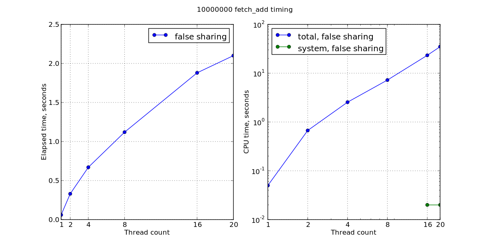
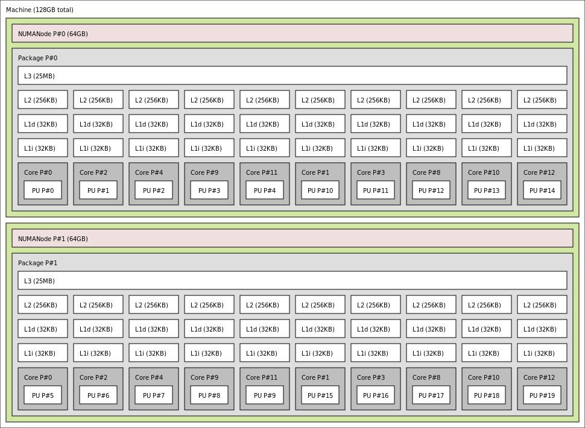

# Tracking down cacheline contention with perf

## Cacheline contention? What's that?

Consider [this program](./src/falsesharing.cpp)

```c++

void counterBumpThread(std::atomic<int>* cnt, unsigned N) {
    for (; N-- != 0;) { cnt->fetch_add(1); }
}

void run(unsigned tCount, unsigned N) {
    std::vector<std::atomic<int>> counters(tCount);
    for (auto& x: counters) { x.store(0); }
    std::vector<std::thread> threads;
    for (auto& x: counters) {
        threads.emplace_back(counterBumpThread, &x, N);
    }
    for (auto& t: threads) { t.join(); }
}
```

### Expectations


* Run time does not depend on number of threads if there are enough cores
* Run time grows linearly with the number of repetitions **N**

---

### Reality

With 2 x Xeon E5-2687W (2 sockets, 10 cores per a package, total: 20 cores)



There are enough cores, but the run time heavily depends on number of threads.

---

## Memory caches


The memory of multicore CPUs is a hierarchical network



---

### How caches store data

<table>
  <tr>
    <th colspan="3">Memory address</th>
    <th colspan="3">Cache entry</th>
  </tr>
  <tr>
    <td>Tag</td>
    <td>Index</td>
    <td>Block offset</td>
    <td>Tag</td>
    <td>Data block (cacheline)</td>
    <td>Flags</td>
  </tr>
  <tr>
    <td></td>
    <td>[13:6]</td>
    <td>[5:0]</td>
    <td></td>
    <td>64 bytes of data</td>
    <td></td>
  </tr>
</table>


---

## False sharing

* Load requires read-only access to the cache line
* Store requires write access and invalidates other copies

Write access to **different** locations in the same cache line is serialized
(i.e. only one core at a time can perform a store).

[](https://www.youtube.com/embed/UOlOrACAj6o)


### Finding false sharing with `perf`

```bash
   sudo perf c2c record --call-graph=fp ./bin/falsesharing -t 20
   sudo perf c2c report -g
```

---

### Fixing false sharing

* Align elements of `counters` vector at 64 bytes: **alignas(64)**
* Force [std::allocator](https://en.cppreference.com/w/cpp/memory/allocator) to obey the alignment: **-faligned-new**

```c++

void counterBumpThread(std::atomic<int>* cnt, unsigned N) {
    for (; N-- > 0;) { cnt->fetch_add(1); }
}

struct alignas(64) AlignedAtomicInt {
    std::atomic<int> val;
};

void run(unsigned tCount, unsigned N) {
    std::vector<AlignedAtomicInt> counters(tCount);
    for (auto& x: counters) { x.val.store(0); }
    std::vector<std::thread> threads;
    for (auto& x: counters) {
        threads.emplace_back(counterBumpThread, &(x.val), N);
    }
    for (auto& t: threads) { t.join(); }
}
```

---

## Summary

* False sharing subtly turns the parallel code into the sequential
* Performance hit is especially severe in a NUMA system (10x or even more)
* STL containers often provoke false sharing
* [perf c2c](http://man7.org/linux/man-pages/man1/perf-c2c.1.html) helps to track down false sharing

---

### Ugly technical details

#### Obtaining meaningful stack traces

There are several ways to unwind the stack:

1. frame pointers (`rbp` register on x86_64), typically disabled by compiler optimizations
2. [DWARF](http://www.dwarfstd.org/doc/Debugging%20using%20DWARF-2012.pdf)
   (debugging with attributed record formats), complicated state machine
3. [LBR](https://lwn.net/Articles/680985) CPU facility (recent Intel CPUs)

To use DWARF `perf` needs to copy the whole stack area (default: 32MB on x86_64)
to userspace (and do stack unwinding during `perf script` or `perf report`).
If the event driving the profiling happens frequently (CPU cycle, memory load/store,
etc) the data rate can be overwhelming (~ 100 -- 500 MB/sec). Such an overhead
is typically unacceptable.

On the other hand `perf` can unwind stack with frame pointers in the kernel
and copy less than 1KB (unless the call chain is longer than 128). However
there's an implicit overhead: the compiler can't use the `rbp` register for
other purposes, so the code with frame pointers enabled might be up to 15%
slower. Thus distributions compile software with frame pointers disabled,
hence a recompilation with `-fno-omit-frame-pointer` compiler option is required.
