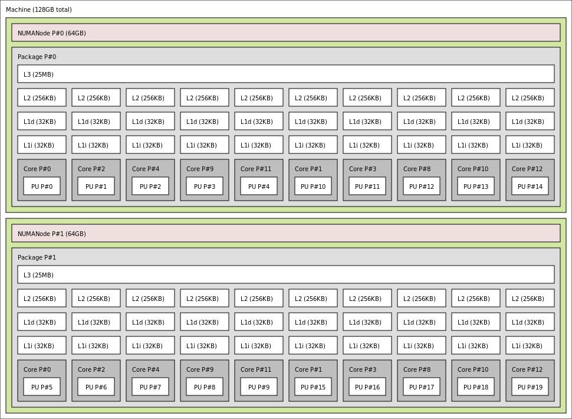
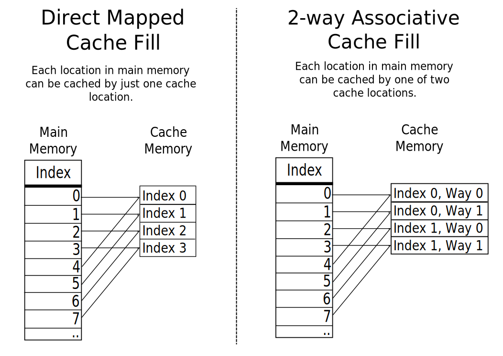

# Tracking down cache line contention with perf

## Introduction

What could be possibly wrong with this program?

```c++

void counterBumpThread(std::atomic<int>* cnt, unsigned N) {
    for (; N-- != 0;) { cnt->fetch_add(1); }
}

void run(unsigned tCount, unsigned N) {
    std::vector<std::atomic<int>> counters(tCount);
    for (auto& x: counters) { x.store(0); }
    std::vector<std::thread> threads;
    for (auto& x: counters) {
        threads.emplace_back(counterBumpThread, &x, N);
    }
    for (auto& t: threads) { t.join(); }
}
```

### Expectations


* Run time does not depend on number of threads if there are enough cores
* Run time grows linearly with the number of repetitions **N**


### Reality

#### With 4-core 8-thread CPU (Core i7-7700)

[demo time]

#### With dual-socket 10-core CPUs (2 x Xeon E5-2687W)

[demo time]

There are enough cores, but the run time heavily depends on number of threads.


## Memory caches


The memory of multicore CPUs is a hierarchical network




### How caches store data

<table>
  <tr>
    <th colspan="3">Memory address</th>
    <th colspan="3">Cache entry</th>
  </tr>
  <tr>
    <td>Tag</td>
    <td>Index</td>
    <td>Block offset</td>
    <td>Tag</td>
    <td>Data block (cacheline)</td>
    <td>Flags</td>
  </tr>
  <tr>
    <td></td>
    <td>[13:6]</td>
    <td>[5:0]</td>
    <td></td>
    <td>64 bytes of data</td>
    <td></td>
  </tr>
</table>




## False sharing

* Load requires read-only access to the cache line
* Store requires write access and invalidates other copies

Write access to **different** locations in the same cache line is serialized
(i.e. only one core at a time can perform a store).

[](https://www.youtube.com/embed/UOlOrACAj6o)

