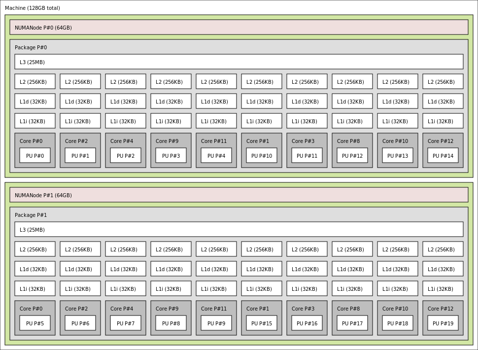

=============================================
Tracking down cache line contention with perf
=============================================

Introduction
============

What could be possibly wrong with this program?

.. code:: C++

   void counterBumpThread(std::atomic<int>* cnt, unsigned N) {
       for (; N-- != 0;) { cnt->fetch_add(1); }
   }

   void run(unsigned tCount, unsigned N) {
       std::vector<std::atomic<int>> counters(tCount);
       for (auto& x: counters) { x.store(0); }
       std::vector<std::thread> threads;
       for (auto& x: counters) {
           threads.emplace_back(counterBumpThread, &x, N);
       }
       for (auto& t: threads) { t.join(); }
   }

Expectations
------------

* Run time does not depend on number of threads if there are enough cores
* Run time grows linearly with the number of repetitions **N**

Reality
-------

With 4-core 8-thread CPU (Core i7-7700)
~~~~~~~~~~~~~~~~~~~~~~~~~~~~~~~~~~~~~~~

[demo time]

With dual-socket 10-core CPUs (2 x Xeon E5-2687W)
~~~~~~~~~~~~~~~~~~~~~~~~~~~~~~~~~~~~~~~~~~~~~~~~~

[demo time]

There are enough cores, but the run time heavily depends on number of threads.

Memory caches
=============

The memory of multicore CPUs is a hierarchical network

How caches store data
---------------------

+-----------------------------+--------------------------------+
|  Memory address             |      Cache entry               |
+=====+========+==============+=====+==================+=======+
| Tag | index  | block offset | Tag |   cache line     | flags |
+-----+--------+--------------+-----+------------------+-------+
|     | [13:6] |    [5:0]     |     | 64 bytes of data |       |
+-----+--------+--------------+-----+------------------+-------+

.. image:: Cache_Fill.svg
   :alt: direct fill and two-way caches

False sharing
=============

* Load requires read-only access to the cache line
* Store requires write access and invalidates other copies

Write access to **different** locations in the same cache line is serialized
(i.e. only one core at a time can perform a store).

.. raw:: html

   <iframe width="560" height="315" src="https://www.youtube.com/embed/UOlOrACAj6o?controls=0" frameborder="0" allow="accelerometer; autoplay; encrypted-media; gyroscope; picture-in-picture" allowfullscreen></iframe>

